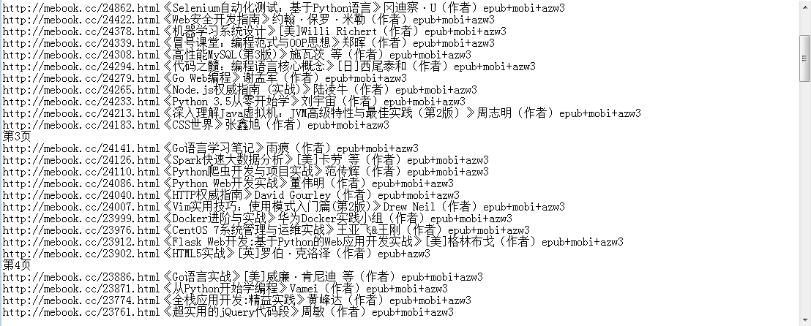
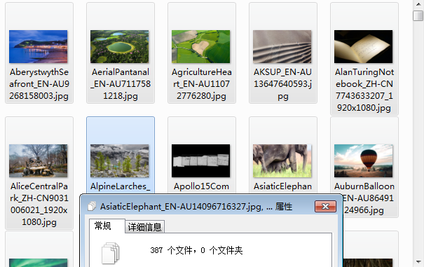
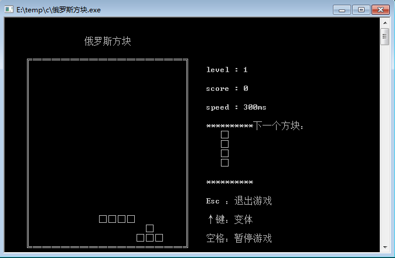
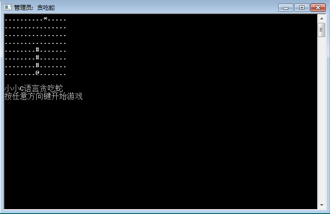
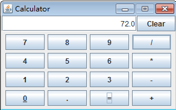

# MyProjects 
:computer:

## 项目整理

|  | PROJECTS |
| ------ | ------|
| 完整项目 | > [B/S分布式电商项目-品优购](./pinyougou-parent) |

#### 整体项目

- 
- [java学生管理系统](./TheStudentSystem)
 
- [java服装销售系统](./FZXS)
- [C/S图书管理系统](./LibraryManager)
- [雷霆战机](./LeiTingZhanJi)
- [汤姆猫TomCat](./MyTomCat)
- [易立方商城](./Enterprise_mall)
 

#### python

> [图片转字符画](./PythonDrawAscii)
> [Python爬虫项目](./PythonCrawler)
 
 
 
 
#### c

- C语言小游戏（[五子棋]()、[贪吃蛇]()、[俄罗斯方块]()）
- 算法实现（[词法分析]()、[回溯法]()）
 
 
 

### java

- [java编译器](./JavaIDE)
 
- [java实现邮件工具](./EMailUtils)
- [java版计算器](./Calculator)
- [java版五子棋](./Gomoku)
 
- [java爬虫项目](./JavaCrawler)
- 获取本机MAC地址

### html

- [html实现拼图游戏](./Html_Pintu)
 

### JavaScript

- [Quark网络交流平台](./OnlineFriend)
 