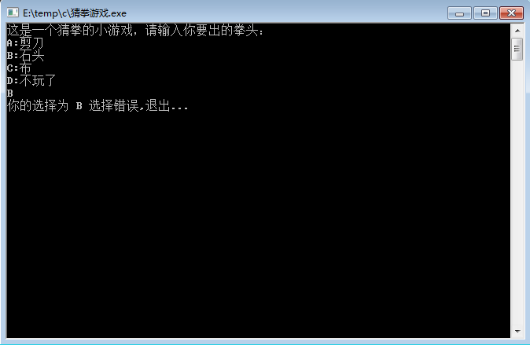

# MyProjects

## 项目整理

#### 整体项目

- [B/S分布式电商项目-品优购](./pinyougou-parent)
- [java学生管理系统]()
 
- [java服装销售系统]()
- [C/S图书管理系统]()
- [雷霆战机]()
- [汤姆猫TomCat]()
- [易立方商城](./Enterprise_mall)
 

#### python

- [图片转字符画]()
- [Python爬虫项目]()
 
 
 
 
#### c

- C语言小游戏（[五子棋]()、[贪吃蛇]()、[俄罗斯方块]()）
- 算法实现（[词法分析]()、[回溯法]()）
 
 
 

### java

- [java编译器]()
 
- [java实现邮件工具](./EMailUtils)
- [java版计算器](./Calculator)
- [java版五子棋]()
 
- [java爬虫项目]()

### html

- [html实现拼图游戏]()
 

### JavaScript

- [Quark网络交流平台]()
 