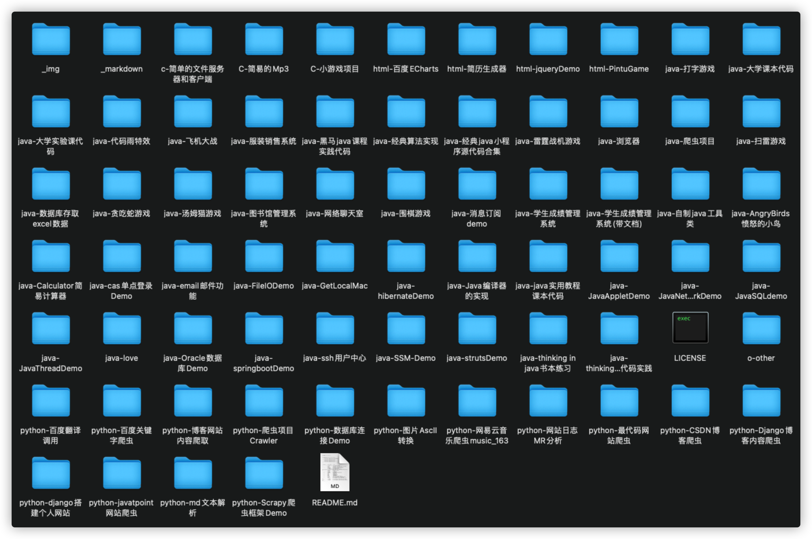

### 项目整理集合 

---

	

 
	&nbsp;&nbsp;
	&nbsp;&nbsp;
	
  
	
	
	
	
	

✨项目开发记录，开发语言有Java、C、Python等，大量的学习实践项目，所有的项目源代码都在这，可以直接导入工具运行，感兴趣的欢迎star✨和fork。My project development record,and those who are interested are welcome to study with star and fork.

---

---

| :floppy_disk: |      | :computer:PROJECTS       | :pencil2:                                                    |      |
| :-----------: | ---- | ------------------------ | :----------------------------------------------------------- | ---- |
|       1       |      | [java编译器](./java)     | 使用javaAPI调用cmd实现java编译器功能                         |      |
|       2       |      | 易立方商城               | SSM实现的购物商城，实现了主页搜索、商品管理、购物车管理、广告管理、用户管理。。。 |      |
|       3       |      | 汤姆猫TomCat             | 使用JAVA开发的TomCat，汤姆猫手机游戏，利用重绘实现           |      |
|       4       |      | Quark网络交流平台        | 基于JSP实现的网络平台，实现了用户登录/注册功能、文章发表功能。。。 |      |
|       5       |      | html实现拼图游戏         | 利用html实现的网页版九宫格拼图游戏                           |      |
|       6       |      | B/S分布式电商项目-品优购 | 基于B/S的分布式电商项目，实现了B2B2C的功能。技术栈：Spring+SpringMVC+MyBatis+solr+Redis+Maven+...,实现的功能模块有运营商管理、商品管理、广告管理、购物车管理、页面静态化、搜索管理、秒杀模块等。。。 |      |
|       7       |      | 获取本机MAC地址          | 利用JAVAAPI实现本地MAC地址的获取                             |      |
|       8       |      | Java爬虫项目             | Java爬虫项目                                                 |      |
|       9       |      | java版五子棋             | Java实现的五子棋小游戏                                       |      |
|      10       |      | java版计算器             | Java版小窗体计算器                                           |      |
|      11       |      | java实现邮件工具         | JavaAPI实现邮件功能（通过QQ邮件服务器进行收发邮件）          |      |
|      12       |      | C语言版五子棋            | C语言实现的五子棋小游戏                                      |      |
|      13       |      | 回溯法                   | C语言实现算法--回溯法                                        |      |
|      14       |      | 词法分析                 | C语言实现词法分析器                                          |      |
|      15       |      | 俄罗斯方块               | C语言实现的俄罗斯方块小游戏                                  |      |
|      16       |      | 贪吃蛇                   | C语言实现的贪吃蛇小游戏                                      |      |
|      17       |      | 猜拳游戏                 | C语言实现的猜拳小游戏                                        |      |
|      18       |      | Python爬虫               | 各种Python爬虫小项目，简单的从网页上爬取并进行下载           |      |
|      19       |      | 图片转字符画             | 使用Python的PIL库实现的图片转字符画，（视频转字符视频未完成，格式问题） |      |
|      20       |      | 雷霆战机                 | 使用JAVA开发的雷霆战机小游戏，利用到了java的画板的线程进行重绘 |      |
|      21       |      | C/S图书管理系统          | 基于C/S开发的图书管理系统，实现功能有图书管理、用户管理、借书/还书功能、查找功能。。。 |      |
|      22       |      | java学生管理系统         | 基于C/S设计开发的学生管理系统，实现了教师和学生的用户管理、成绩管理、课程管理、选课服务。。。 |      |
|      23       |      | java服装销售系统         | 基于C/S架构设计的服装销售系统，使用简单的MVC实现功能，具有仓库管理、订单管理、销售管理... |      |
|      24       |      | ...... |.......||

## License

[Apache](../LICENSE)
